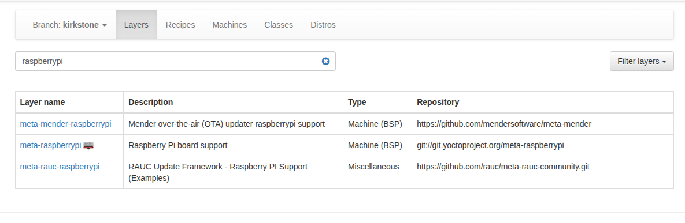
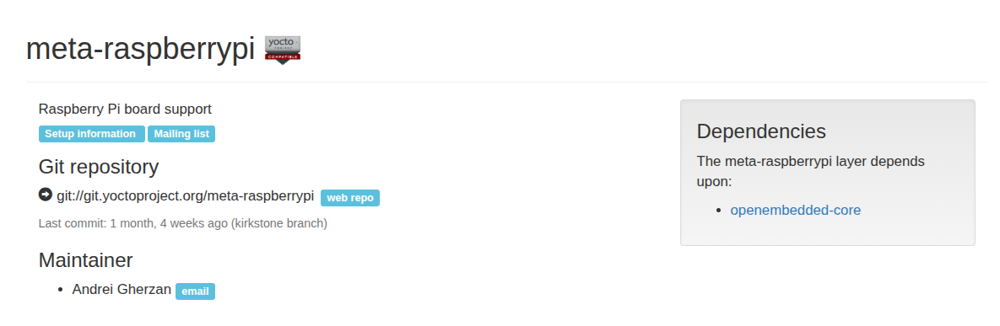
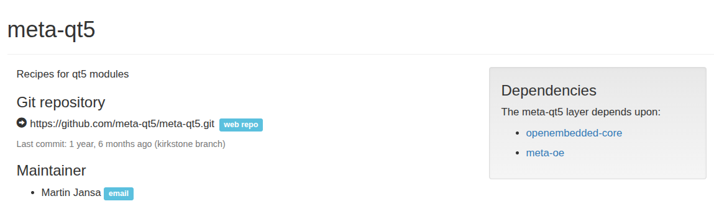

## Yocto Infotainment Project for RaspberryPi4
A step-by-step breakdown of The Project

---
## Pre-development Stage
### Install Dependencies (Ubuntu)
- Prepare **Environment** on HOST machine

```bash
sudo apt install gawk wget git diffstat unzip texinfo gcc build-essential chrpath socat cpio python3 python3-pip python3-pexpect xz-utils debianutils iputils-ping python3-git python3-jinja2 libegl1-mesa libsdl1.2-dev python3-subunit mesa-common-dev zstd liblz4-tool file locales libacl1
sudo locale-gen en_US.UTF-8
```
### Download Poky
Poky is the reference build system for the Yocto Project. It performs cross-compiling using the BitBake tool, OpenEmbedded Core, and a default set of metadata.
```bash
# clone poky.
git clone -b kirkstone https://github.com/yoctoproject/poky.git
cd poky
```

### Initialize the Build Environment
Run inside `poky`:
```bash
source oe-init-build-env
```
This creates the `build` directory and sets up environment variables.

### BitBake Configurations
1. **`build/conf/bblayers.conf`** → Specifies the layers included in the build, ex :`meta-openembedded`.
2. **`build/conf/local.conf`** → Contains user-specific settings (e.g., `MACHINE`, `DISTRO`).
3. **`meta/conf/layer.conf`** → Defines how BitBake processes each layer, including priorities and dependencies.

### BitBake Custom Layers 
- **`meta-distros`** → 2 distribution configurations (Distro 1 : Infotainment, Distro 2 : Audio).
- **`meta-IVI`** → Contains an image recipe with a C++ application and Nano editor.

### Integrate BSP Layer for Raspberry Pi
1. go to (https://layers.openembedded.org/layerindex/branch/kirkstone/layers/)
2. search for raspberrypi, and select (meta-raspberrypi) layer

3. clone meta-raspberrypi from here :
```bash
git clone -b kirkstone git://git.yoctoproject.org/meta-raspberrypi
```

4. add the layer to the bblayers.conf
```bash
bitbake-layers add-layer ../meta-raspberrypi
```
5. clone the openembedded-core
```bash
git clone -b kirkstone git://git.openembedded.org/openembedded-core
```
### Integrate Qt-5
1. go to  (https://layers.openembedded.org/layerindex/branch/kirkstone/layers/)
2. search for Qt, and select (meta-qt5) layer

3. clone meta-qt5 from here :
```bash
git clone -b kirkstone https://github.com/meta-qt5/meta-qt5.git
```
4. add the layer to the bblayers.conf
```bash
bitbake-layers add-layer ../meta-qt5
```
---
## Create Distribution Layer (meta-distros)
1. Create the Layer Directory Structure
```bash
mkdir -p meta-distros/conf/distro 
touch meta-distros/conf/distro/ivi.conf
touch meta-distros/conf/distro/audio.conf
```
2. Add `meta-distros` layer to the bblayers.conf
``` bash 
bitbake add-layer meta-distros
```

### **Create Infotainment Distro**
Edit `ivi.conf`:

### Enable Systemd for Infotainment Distribution (`ivi.conf`)
Poky uses `sysvinit` by default. Switch to `systemd`:
**Add systemd to the distro**
- go to meta-distros/conf/distro
- create include directory
- create systemd.inc and add this : 
```bash
DISTRO_FEATURES:append = " systemd "
VIRTUAL-RUNTIME_init_manager = "systemd"
VIRTUAL-RUNTIME_initscript = "systemd-compat-units"
```
**Configure Systemd** 
Edit `ivi.conf`: 

```bash
#include systemd.inc
require conf/distro/include/systemd.inc

# install systemd  as init manager 
DISTRO_FEATURES:append = " systemd" 

# select systemd as init manager 
VIRTUAL-RUNTIME_init_manager = " systemd"
VIRTUAL-RUNTIME_initscripts = " systemd-compat-units"
```

### **Create Audio Distro**
 Edit `audio.conf`:


---
## Create SW Layer (meta-IVI)
1. create layer
```bash
bitbake create-layer meta-IVI
```
2. add meta-IVI to the bblayers.conf

```bash
bitbake add-layer meta-IVI
```
---
## Create Cpp Package Recipe `helloworld`

---
## Integrate Nano
1. create `receipes-editor` directory inside meta-IVI layer
2. create `nano` directory inside `receipes-editor` 
3. create nano receipe using "recipetool"
```bash
mkdir -p meta-IVI/recipes-editors/nano
cd meta-IVI/recipes-editors/nano
recipetool create -o nano_1.0.bb https://ftp.gnu.org/gnu/nano/nano-7.2.tar.xz
bitbake nano
```
4. Install dependencies required for building Nano
```bash 
sudo apt install autoconf automake autopoint gcc gettext git groff make pkg-config texinfo
```
5. Fetch and unpack the source code
```bash
bitbake -c fetch nano
bitbake -c unpack nano
```
6. Find the WORKDIR path:
```bash
bitbake -e nano | grep -i "^WORKDIR="
```
Navigate to the `WORKDIR/git` path

7. Run autogen.sh to generate the configure script:
```bash
./autogen.sh
```
8. Build the Recipe:
```bash
bitbake nano
```

---
## Integrate Audio
1. Create the `classes/` directory inside (meta-IVI) layer
2. create the class (audio.bbclass)
```bash
cd meta-IVI
mkdir -p classes
touch classes/audio.bbclass
```
3. Edit the class: 
```bash
IMAGE_INSTALL:append = " pavucontrol pulseaudio pulseaudio-module-dbus-protocol pulseaudio-server \
        pulseaudio-module-loopback pulseaudio-module-bluetooth-discover alsa-ucm-conf pulseaudio-module-bluetooth-policy alsa-topology-conf alsa-state alsa-lib alsa-tools \
        pulseaudio-module-bluez5-device pulseaudio-module-bluez5-discover alsa-utils alsa-plugins packagegroup-rpi-test can-utils net-tools gstreamer1.0 \
        iproute2 iputils libsocketcan bluez5 i2c-tools hostapd iptables"
```
---
## Create the Image Recipe: ivi-test-image.bb

### Inheritance 

### Package Installation 

### Image Features 
### Machine Features 
---
## Building an Image