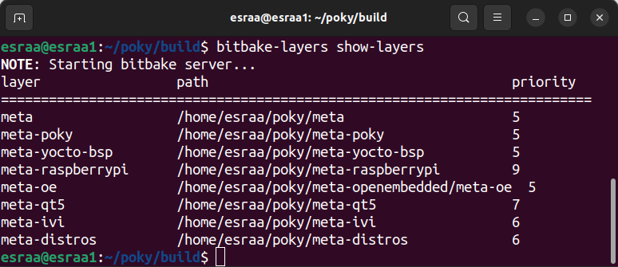

## Yocto Infotainment Project for RaspberryPi4
This project demonstrates how to build a custom Linux-based image for Raspberry Pi 4 using the Yocto Project. It includes two different distributions (Infotainment & Audio), integrates Qt5 for GUI applications, and adds custom software layers for testing, audio features, and system configuration. 

Here's a step-by-step breakdown of The Project : 

---
## Pre-development Stage
### Install Dependencies (Ubuntu)
- Prepare **Environment** on HOST machine

```bash
sudo apt install gawk wget git diffstat unzip texinfo gcc build-essential chrpath socat cpio python3 python3-pip python3-pexpect xz-utils debianutils iputils-ping python3-git python3-jinja2 libegl1-mesa libsdl1.2-dev python3-subunit mesa-common-dev zstd liblz4-tool file locales libacl1
sudo locale-gen en_US.UTF-8
```

### Download Poky
Poky is the reference build system for the Yocto Project. It performs cross-compiling using the BitBake tool, OpenEmbedded Core, and a default set of metadata.
```bash
# clone poky.
git clone -b kirkstone https://github.com/yoctoproject/poky.git
# switch directory
cd poky
```

### Initialize the Build Environment
Run inside `poky`:
```bash
source oe-init-build-env
```
This creates the `build` directory and sets up environment variables.

### Configure Local Build Settings
Edit `local.conf`:
```bash 
# change Machine Variable.
MACHINE ??="raspberrypi4"

# Add Number of threads:
BB_NUMBER_THREADS="8"
PARALLEL_MAKE="-j 8"
```
- **`MACHINE`** → Raspberry Pi 4 (32 bits) as a target hardware.
- **`BB_NUMBER_THREADS & PARALLEL_MAKE`** → Optimize build using multiple CPU cores.

### BitBake Configurations
1. **`build/conf/bblayers.conf`** → Specifies the layers included in the build, ex :`meta-openembedded`.
2. **`build/conf/local.conf`** → Contains user-specific settings (e.g., `MACHINE`, `DISTRO`).
3. **`meta/conf/layer.conf`** → Defines how BitBake processes each layer, including priorities and dependencies.

### BitBake Custom Layers 
- **`meta-distros`** → 2 distribution configurations (Distro 1: Infotainment, Distro 2: Audio).
- **`meta-IVI`** → Contains an image recipe with a C++ application and Nano editor.

### Integrate BSP Layer for Raspberry Pi

1. go to (https://layers.openembedded.org/layerindex/branch/kirkstone/layers/)
2. search for raspberrypi, and select (meta-raspberrypi) layer

3. clone meta-raspberrypi from here :
```bash
git clone -b kirkstone git://git.yoctoproject.org/meta-raspberrypi
```

4. add the layer to the bblayers.conf
```bash
bitbake-layers add-layer ../meta-raspberrypi
```
5. clone the openembedded-core
```bash
git clone -b kirkstone git://git.openembedded.org/openembedded-core
```

### Integrate Qt-5
1. go to  (https://layers.openembedded.org/layerindex/branch/kirkstone/layers/)
2. search for Qt, and select (meta-qt5) layer

3. clone meta-qt5 from here :
```bash
git clone -b kirkstone https://github.com/meta-qt5/meta-qt5.git
```
4. add the layer to the bblayers.conf
```bash
bitbake-layers add-layer ../meta-qt5
```

---
## Create Distribution Layer (meta-distros)
1. Create the Layer Directory Structure
```bash
mkdir -p meta-distros/conf/distro 
touch meta-distros/conf/distro/ivi.conf
touch meta-distros/conf/distro/audio.conf
```
2. Add `meta-distros` layer to the bblayers.conf
``` bash 
bitbake-layers add-layer meta-distros
```

### Create Infotainment Distro
Edit `ivi.conf`:

```bash 
DISTRO="ivi"
DISTRO_NAME="Bullet-ivi"
DISTRO_VERSION="1.0"

MAINTAINER="esraasamir609@gmail.com"


# SDK Information.
SDK_VENDOR = "-bulletSDK"
SDK_VERSION = "${@d.getVar('DISTRO_VERSION').replace('snapshot-${METADATA_REVISION}', 'snapshot')}"
SDK_VERSION[vardepvalue] = "${SDK_VERSION}"

SDK_NAME = "${DISTRO}-${TCLIBC}-${SDKMACHINE}-${IMAGE_BASENAME}-${TUNE_PKGARCH}-${MACHINE}"
# Installation path --> can be changed to ${HOME}-${DISTRO}-${SDK_VERSION}
SDKPATHINSTALL = "/opt/${DISTRO}/${SDK_VERSION}" 

# Disribution Feature --> NOTE: used to add customize package (for package usage).

# infotainment --> INFOTAINMENT

INFOTAINMENT_DEFAULT_DISTRO_FEATURES = "largefile opengl ptest multiarch vulkan x11 bluez5 bluetooth wifi ivi_variant"

# TODO: to be org.

DISTRO_FEATURES ?= "${DISTRO_FEATURES_DEFAULT} ${INFOTAINMENT_DEFAULT_DISTRO_FEATURES} userland"


# prefered version for packages.
PREFERRED_VERSION_linux-yocto ?= "5.15%"
PREFERRED_VERSION_linux-yocto-rt ?= "5.15%"


# Build System configuration.

LOCALCONF_VERSION="2"

# add poky sanity bbclass
INHERIT += "poky-sanity"
```
Update `local.conf` to use infotainment distro:
```bash
DISTRO ?= "ivi"
```

### Enable Systemd for Infotainment Distribution (`ivi.conf`)
Poky uses `sysvinit` by default. Switch to `systemd`:
- go to meta-distros/conf/distro
- create include directory
- create systemd.inc and add this : 
```bash
# install systemd  as init manager 
DISTRO_FEATURES:append = " systemd" 

# select systemd as init manager 
VIRTUAL-RUNTIME_init_manager = " systemd"
VIRTUAL-RUNTIME_initscripts = " systemd-compat-units"
```

Edit `ivi.conf` to include systemd.inc: 
```bash
#include systemd.inc
require conf/distro/include/systemd.inc
```

### **Create Audio Distro**
Edit `audio.conf`:
```bash 
DISTRO="audio"
DISTRO_NAME="Bullet-audio"
DISTRO_VERSION="1.0"

MAINTAINER="esraasamir609@gmail.com"


# SDK Information.
SDK_VENDOR = "-bulletSDK"
SDK_VERSION = "${@d.getVar('DISTRO_VERSION').replace('snapshot-${METADATA_REVISION}', 'snapshot')}"
SDK_VERSION[vardepvalue] = "${SDK_VERSION}"

SDK_NAME = "${DISTRO}-${TCLIBC}-${SDKMACHINE}-${IMAGE_BASENAME}-${TUNE_PKGARCH}-${MACHINE}"
# Installation path --> can be changed to ${HOME}-${DISTRO}-${SDK_VERSION}
SDKPATHINSTALL = "/opt/${DISTRO}/${SDK_VERSION}" 

# Disribution Feature --> NOTE: used to add customize package (for package usage).

# audio --> AUDIO

AUDIO_DEFAULT_DISTRO_FEATURES = "largefile opengl ptest multiarch vulkan x11 bluez5 bluetooth wifi audio_variant"
AUDIO_DEFAULT_EXTRA_RDEPENDS = "packagegroup-core-boot"
AUDIO_DEFAULT_EXTRA_RRECOMMENDS = "kernel-module-af-packet"

# TODO: to be org.

DISTRO_FEATURES ?= "${DISTRO_FEATURES_DEFAULT} ${AUDIO_DEFAULT_DISTRO_FEATURES} userland"


# prefered version for packages.
PREFERRED_VERSION_linux-yocto ?= "5.15%"
PREFERRED_VERSION_linux-yocto-rt ?= "5.15%"


# Build System configuration.

LOCALCONF_VERSION="2"

# add poky sanity bbclass
INHERIT += "poky-sanity"
``` 
Update `local.conf` to use audio distro:
```bash
DISTRO ?= "audio"
```
---
## Create SW Layer (meta-IVI)
1. create layer
```bash
bitbake create-layer meta-IVI
```
2. add meta-IVI to the bblayers.conf

```bash
bitbake add-layer meta-IVI
```
---
## Create Cpp App Recipe `helloworld`
1. Create `recipes-examples` directory inside (meta-IVI) layer
2. create `helloworld` directory inside `recipes-examples` 
3. create helloworld recipe using the "recipetool"
```bash
mkdir -p meta-IVI/recipes-examples/helloworld
cd meta-IVI/recipes-examples/helloworld
recipetool create -o helloworld_1.0.bb https://github.com/embeddedlinuxworkshop/y_t1.git
```
**After generating the recipe and adding some changes, the Final Recipe:**
```bash
# Recipe created by recipetool
# This is the basis of a recipe and may need further editing in order to be fully functional.
# (Feel free to remove these comments when editing.)

# TODO: 1. Decumentation Variables
SUMMARY		= "Example for Native C++ Application for Testing YOCTO"
DESCRIPTION	= "Example for Native C++ Application for Testing YOCTO. Provided by Bullet Guru"
HOMEPAGE	= "http://github.com/embeddedlinuxworkshop/y_t1"

# Unable to find any files that looked like license statements. Check the accompanying
# documentation and source headers and set LICENSE and LIC_FILES_CHKSUM accordingly.
#
# NOTE: LICENSE is being set to "CLOSED" to allow you to at least start building - if
# this is not accurate with respect to the licensing of the software being built (it
# will not be in most cases) you must specify the correct value before using this
# recipe for anything other than initial testing/development!

# TODO: 2. Licence Variables
LICENSE = "CLOSED"
LIC_FILES_CHKSUM = ""

# TODO: 3. Source Code Variables
SRC_URI = "git://github.com/embeddedlinuxworkshop/y_t1.git;protocol=https;branch=master"

# Modify these as desired
PV = "1.0+git${SRCPV}"
SRCREV = "49600e3cd69332f0e7b8103918446302457cd950"

S = "${WORKDIR}/git"

# TODO: 4. Tasks Excuted through the Build Engine
# NOTE: no Makefile found, unable to determine what needs to be done


do_compile () {
     # Specify compilation commands here
     ${CXX} ${CXXFLAGS} ${LDFLAGS} ${S}/main.cpp -o ${B}/helloworld
}

do_install() {
      # Specify install commands here
	
      # 1. manipulate -> ${WORKDIR}/image
      # 2. Create Directory ${WORKDIR}/image/usr/bin
      install -d ${D}/${bindir}
      
      #3. installing hello bin in Directory ${WORKDIR}/image/usr/bin
      install -m 0755 ${B}/helloworld ${D}${bindir}
}
```
**do_compile ()**
This function is automatically called during the build process to compile source code.
- `${CXX}` → Uses the C++ compiler set by Yocto.

**do_install ()**
used for copying and setting file permissions.
- `install -d` → Creates the destination directory.
- `${D}` `${bindir}` → Installs the compiled binary into `/usr/bin/` inside the target filesystem.
- `install -m 0755` → Copies the file and sets permissions (rwxr-xr-x).

**Build the Recipe:**
```bash
bitbake helloworld
```
---
## Integrate Nano
1. create `recipes-editor` directory inside meta-IVI layer
2. create `nano` directory inside `receipes-editor` 
3. create nano receipe using "recipetool"

```bash
mkdir -p meta-IVI/recipes-editors/nano
cd meta-IVI/recipes-editors/nano
recipetool create -o nano_1.0.bb https://ftp.gnu.org/gnu/nano/nano-7.2.tar.xz
bitbake nano
```
4. Install dependencies required for building Nano
```bash 
sudo apt install autoconf automake autopoint gcc gettext git groff make pkg-config texinfo
```
5. Fetch and unpack the source code
```bash
bitbake -c fetch nano
bitbake -c unpack nano
```
6. Find the WORKDIR path:
```bash
bitbake -e nano | grep -i "^WORKDIR="
```
Navigate to the `WORKDIR/git` path

7. Run autogen.sh to generate the configure script:

```bash
./autogen.sh
```

8. Build the Recipe:
```bash
bitbake nano
```

---
## Integrate Audio
1. Create the `classes/` directory inside (meta-IVI) layer
2. create the class (audio.bbclass)

```bash
cd meta-IVI
mkdir -p classes
touch classes/audio.bbclass
```
3. Edit the class: 
```bash
IMAGE_INSTALL:append = " pavucontrol pulseaudio pulseaudio-module-dbus-protocol pulseaudio-server \
        pulseaudio-module-loopback pulseaudio-module-bluetooth-discover alsa-ucm-conf pulseaudio-module-bluetooth-policy alsa-topology-conf alsa-state alsa-lib alsa-tools \
        pulseaudio-module-bluez5-device pulseaudio-module-bluez5-discover alsa-utils alsa-plugins packagegroup-rpi-test can-utils net-tools gstreamer1.0 \
        iproute2 iputils libsocketcan bluez5 i2c-tools hostapd iptables"
```
---
## Create the Image Recipe: ivi-test-image.bb

### Create Directory Structure 
1. create `recipes-core` directory inside meta-IVI layer
2. create `images` directory inside `recipes-core` 
3. create `ivi-test-image.bb` file 

```bash 
mkdir -p meta-IVI/recipes-core/images
touch meta-IVI/recipes-core/images/ivi-test-image.bb
```
### Define Image Recipe
```bash 
# Include base image "rpi-test-image"
require recipes-core/images/rpi-test-image.bb

# Summary of the Image
SUMMARY = "IVI test image that inlcudes Nano and helloworld package recipe"

inherit audio

# MACHINE_FEATURES #
MACHINE_FEATURES:append=" bluetooth wifi alsa"

# Customize the image #
IMAGE_INSTALL:append = " helloworld openssh nano"

## IMAGE_FEATURES ##
###################################################
# - IMAGE_INSTALL --> ssh                         #
# - allow root access through ssh                 #
# - access root through ssh using empty password  #
###################################################

IMAGE_FEATURES:append = "debug-tweaks ssh-server-openssh" 
```

**Base Image** `require`: Defines the core structure of the image by inheriting from an existing base image `rpi-test-image`.

**Inheritance** `inherit`: Some images inherit special classes that modify their behavior
- Inherit `audio.bbclass` for `audio` distro :
```bash 
inherit audio
```
**Package Installation** `IMAGE_INSTALL`: Specifies additional software packages to be included in the image `nano`, `helloworld`, `openssh`

**Image Features** `IMAGE_FEATURES`: Defines additional capabilities like SSH, debugging tools, or package management `ssh-server-openssh`, `debug-tweaks`.

**Machine Features** `MACHINE_FEATURES`: Defines hardware-specific features available for the target machine `alsa`, `wifi`, `bluetooth`.

---
## Building an Image

Choose the Desired Distro `audio` or `ivi` in `local.conf` and Run:

```bash
bitbake ivi-test-image
```

---
## Results 
After successful configuration and build setup, the Yocto environment was validated using:
```bash
bitbake-layers show-layers
```
**Output:**

layer                 path                                      priority
==========================================================================
meta                  /home/esraa/poky/meta                     5
meta-poky             /home/esraa/poky/meta-poky                5
meta-yocto-bsp        /home/esraa/poky/meta-yocto-bsp           5
meta-raspberrypi      /home/esraa/poky/meta-raspberrypi         6
meta-openembedded     /home/esraa/poky/meta-openembedded        7
meta-qt5              /home/esraa/poky/meta-qt5                 7
meta-distros          /home/esraa/poky/meta-distros             8
meta-IVI              /home/esraa/poky/meta-IVI                 8



This confirms that all layers were successfully added to the build environment, including:
**Board Support Layer (BSP):** `meta-raspberrypi`
**UI Framework:** `meta-qt5`
**Custom Distributions:** `meta-distros`
**Application Layer:** `meta-ivi`

### Image Build Output 
The final image was built using:
```bash 
bitbake ivi-test-image
``` 
