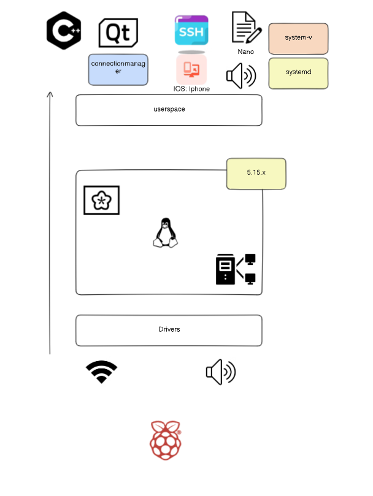

#Yocto Infotainment Project for RaspberryPi4
---

##Target Hardware:
- Raspberry Pi 4

##Packages:
- SSH: Secure Shell for remote access.
- WIFI addon: Support for wireless connectivity.
- Nano: Simple text editor.
- Meta-qt5: Qt5 layer for developing GUI applications.
- Audio: Support for audio playback and recording.
- Native Hello World Application: A sample application for testing.

##Image:
- Image recipe.

##Kernel:
- Version: 5.15.x

##Distributions:
**Distribution 1:**
- Includes Meta-qt5.
- Uses systemd as the init system.

**Distribution 2:**
- Excludes Meta-qt5.
- Uses sysvinit as the init system.

---
